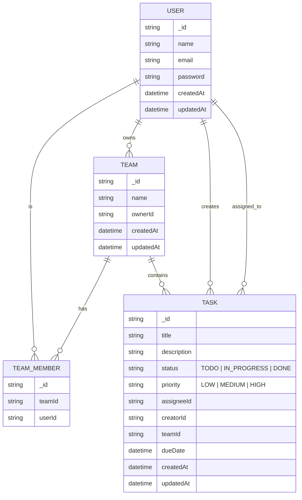

# Task Monitor Backend Service
## Project description
The Task Monitor Backend Service is a **RESTful** API for creating, updating, and monitoring tasks, designed to power a task or productivity application backend, such as Jira. It is built with TypeScript and Node.js and is designed to be easily deployable ( Render) and simple to extend with new features. It is structured as a modern TypeScript/Node.js service with environment-based configuration, linting, and deployment support already wired in.

## Objectives

- Provide a clean, typed backend API for managing and monitoring tasks
- Offer a structure that is easy to extend with new modules (auth, task, teams)
- Support reliable local development with environment-based configuration and automated testing

## Features

These requirements describe a Jira‑style team and task management backend with authentication and token refresh, centered around teams, users, and tasks.

### Domain entities

- **User**: Represents an authenticated account that can belong to teams, create tasks, and be assigned work.
- **Team**: A named group of users for organizing work (squads, projects, departments) similar to Jira projects/boards.
- **Task/Issue**: A unit of work (ticket) that can be created, assigned to users/teams, tracked through statuses, and updated over time.

### User and team features

- **Create team**: Create a new team with a name, optional description, and initial owner/maintainer.
- **Add team member**: Add existing users to a team with roles (member, admin) to control permissions.
- **Remove team member**: Detach a user from a team while preserving their historical task activity.
- **Delete team**: Soft or hard delete a team; optionally restrict deletion if it still has active tasks.

### Task management features

- **Create task**: Create tasks within a team (or globally), including fields like title, description, status, priority, and due date.
- **Update task**: Edit task content, status, assignee, and other fields, respecting permissions and workflow rules.
- **Delete task**: Remove or archive tasks; optionally enforce constraints (only admins can permanently delete).
- **Assign task**: Assign tasks to specific users (and optionally to a team) to mirror Jira’s assignee behavior.
- **List task**: List tasks with filters by team, assignee, status, priority, and search text, plus pagination.

### Listing and querying

- **List team**: Return all teams visible to the current user, with optional filters (by role, ownership).
- **List user**: List users in a team or the entire system, possibly with search and pagination to support assignment dialogs.
- **Jira‑like workflows**: Support To Do/In Progress/Done‑style statuses and future extension to more complex workflows.

### Auth and tokens

- **Authentication**: Login and registration endpoints that issue short‑lived access tokens (JWT) after verifying credentials.
- **Refresh token**: A secure, long‑lived refresh token flow to obtain new access tokens without forcing frequent logins, ideally with rotation and revocation support.
- **Protected routes**: All team and task routes require a valid access token, with role checks ( only team admins can remove members).

## Project structure

Key files and directories in the repository

- `.github/workflows/` – CI/CD workflows for automated checks (tests, lint).
- `.husky/` – Git hooks (pre-commit, pre-push) to enforce code quality
- `src/` – Main application source code (routes, controllers, services, models)
- `.env.example` – Example environment variables for local development
- `.env.test.example` – Example environment variables for running tests
- `.gitignore` – Git ignore rules for node modules, build outputs, and secrets
- `.prettierrc` – Prettier configuration for consistent code formatting
- `Task_monitor.excalidraw` – Architecture/flow diagram of the backend service
- `eslint.config.mjs` – ESLint configuration for linting TypeScript/JavaScript
- `jest.config.json` – Jest test runner configuration
- `package.json` – Project metadata, scripts, and dependencies
- `package-lock.json` / `pnpm-lock.yaml` – Lockfiles for reproducible installs
- `tsconfig.json` – TypeScript compiler options
- `vercel.json` – Configuration for deployment to Vercel

## Getting started

1. Clone the repository and install dependencies:
   ```bash
   git clone https://github.com/KPorus/task-monitor-backend-service.git
   cd task-monitor-backend-service
   pnpm install
   ```
2. Create a `.env` file from `.env.example` and fill in the required values (database URL, ports, etc.)
3. Run the development server:
   ```bash
   pnpm start:dev
   ```


Architecture Diagram of Backend Service



```

```
